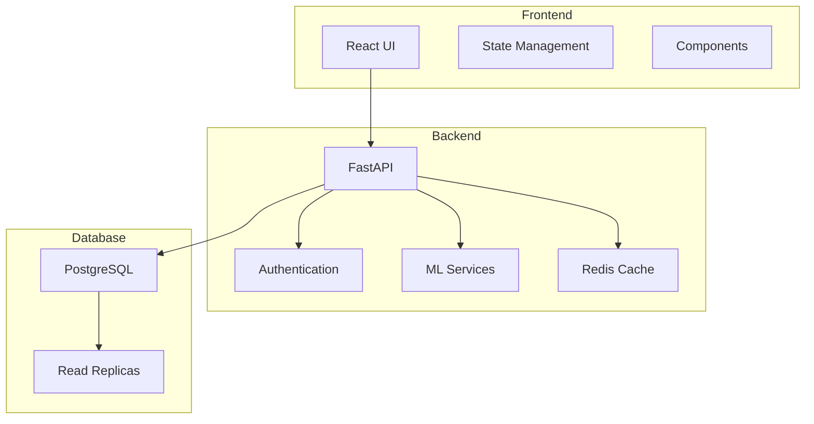
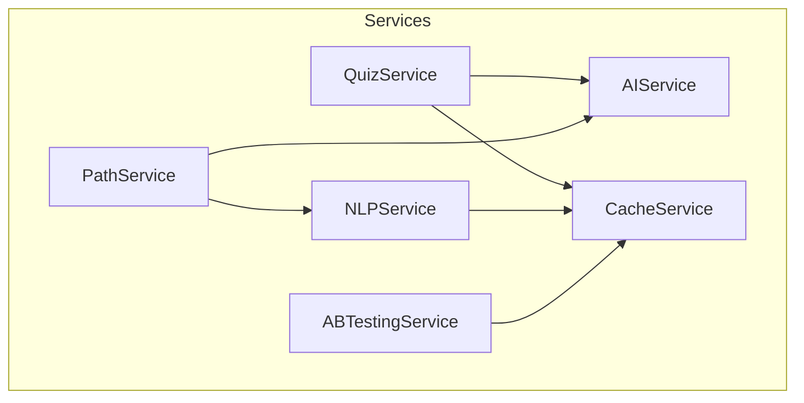
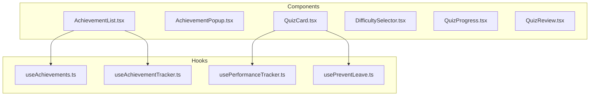
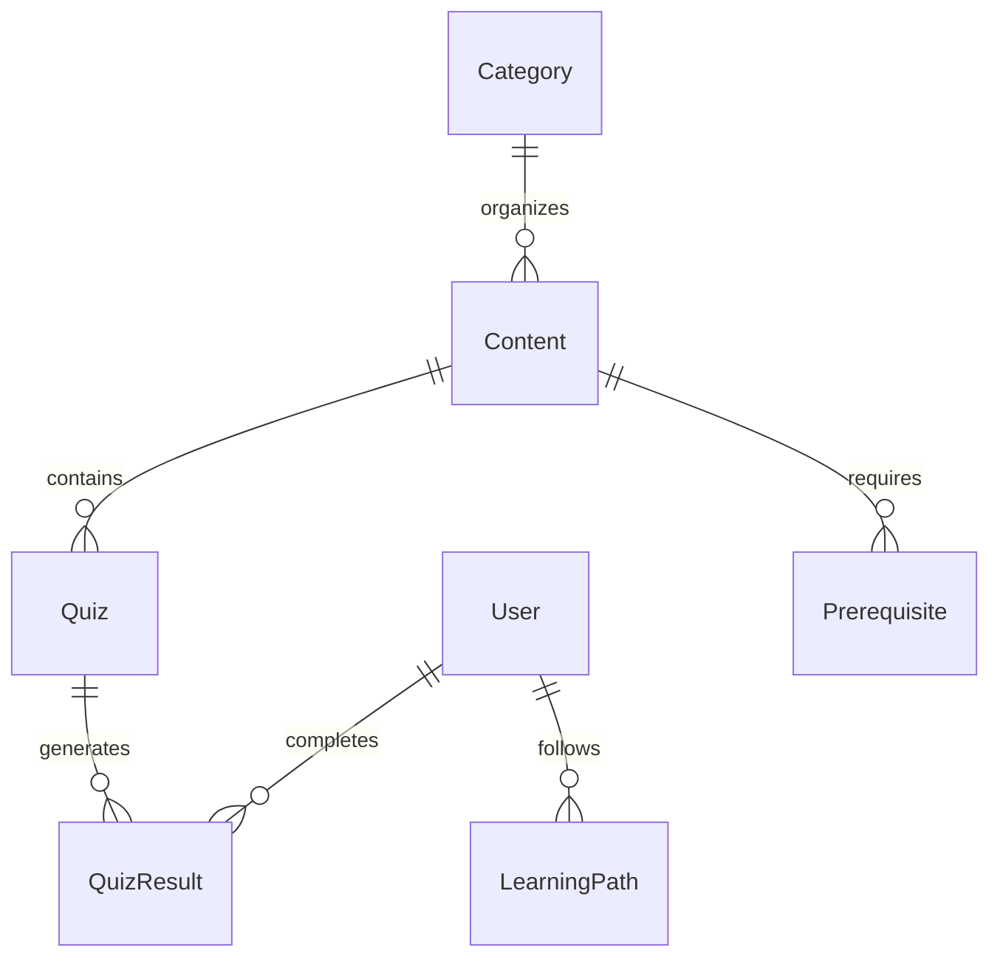
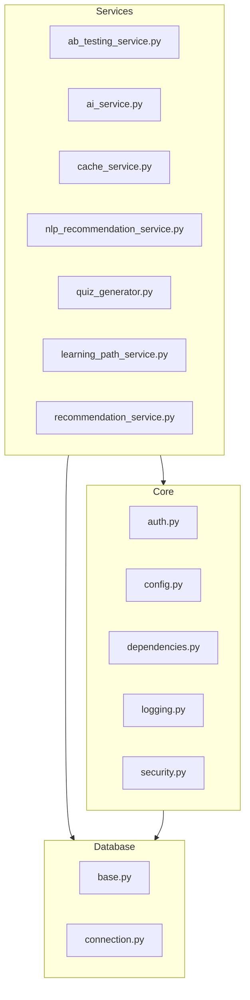
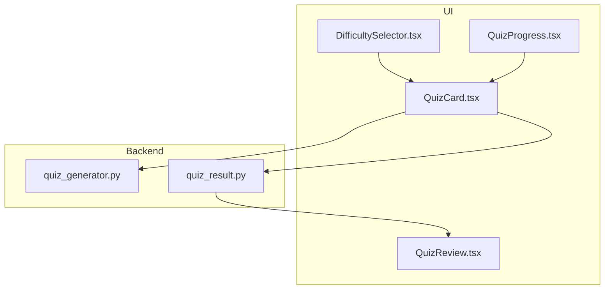

# FoxTrail Learning Platform Documentation

## Project Overview
FoxTrail is a modern learning platform that combines Y2K aesthetic design with advanced AI-powered learning pathways. The platform uses a microservices architecture deployed on DigitalOcean's App Platform, with PostgreSQL database and Redis caching.

### Key Features
- AI-powered learning path generation
- Interactive quizzes with adaptive difficulty
- Achievement system with Y2K-styled rewards
- NLP-based content recommendations
- Real-time progress tracking

### Technology Stack
- **Frontend**: React, TypeScript, Tailwind CSS
- **Backend**: FastAPI, Python 3.11
- **Database**: PostgreSQL on DigitalOcean
- **Caching**: Redis
- **AI/ML**: Custom NLP models
- **Deployment**: DigitalOcean App Platform

### Architecture Overview

<!-- Diagram Viewing Requirements:
1. GitHub: Natively supported
2. VS Code: 
   - Install "Markdown Preview Enhanced" or "Markdown Preview Mermaid Support"
   - Use Command Palette (Cmd/Ctrl + Shift + P)
   - Select "Markdown: Open Preview"
3. Other editors: May require Mermaid plugin/extension
-->



### Service Interactions


### Frontend Component Structure


## Project Structure

### 1. Infrastructure & Deployment

#### 1.1 Root Configuration Files
- `app.yaml`
  **Purpose**: Main deployment configuration for DigitalOcean App Platform
  **Key Features**:
  - Multi-service orchestration
  - GitHub integration
  - Environment configuration
  **Configuration**:
  ```yaml
  name: foxtrail-ai
  services:
    - name: backend
      source_dir: backend
    - name: frontend
      source_dir: frontend
  ```
  **Future Improvements**:
  - Add staging environment
  - Implement blue-green deployments
  - Add performance monitoring

## Current Status
- ✅ Core quiz functionality
- ✅ Achievement system
- ✅ Basic learning paths
- ✅ Search component implementation
- 🏗️ AI-enhanced search (in progress)
- 🏗️ Content generation
- ❌ User contribution system

## Frontend Documentation

### Components

#### achievements/
##### AchievementList.tsx
- **Purpose**: Displays grid of user achievements with Y2K-inspired styling
- **Key Components**:
  - `AchievementList`: Main component for rendering achievement grid
- **Key Features**:
  - Animated achievement cards
  - Visual feedback for locked/unlocked states
  - Responsive grid layout
- **Integration Points**:
  - Used in Dashboard.tsx (see lines 24-29)
  - Consumes data from useAchievementTracker.ts
- **Future Improvements**:
  - Add achievement categories
  - Implement achievement filters
  - Add achievement sharing functionality

##### AchievementPopup.tsx
- **Purpose**: Shows achievement unlock notifications
- **Key Components**:
  - `AchievementPopup`: Animated notification component
- **Key Features**:
  - Animated entrance/exit
  - Sound effects on achievement unlock
  - Customizable duration
- **Integration Points**:
  - Used in Quiz.tsx (see lines 111-113)
  - Triggered by useAchievements hook
- **Future Improvements**:
  - Add notification queue
  - Customize animation per achievement type
  - Add achievement sharing buttons

#### auth/
##### LoginForm.tsx
- **Purpose**: Handles user authentication and login flow
- **Key Components**:
  - `LoginForm`: Main authentication form component
- **Key Features**:
  - Email/password authentication
  - Form validation
  - Error handling
  - Remember me functionality
- **State Management**:
  - Tracks form input states
  - Manages authentication errors
  - Handles loading states
- **Integration Points**:
  - Connects with auth API endpoints
  - Used in Login page
  - Integrates with global auth context
- **Future Improvements**:
  - Add OAuth providers
  - Implement 2FA
  - Add password recovery flow
  - Add biometric authentication for mobile

#### dashboard/
##### Dashboard.tsx
- **Purpose**: Main dashboard component showing user's learning progress and recommendations
- **Key Components**:
  - `Dashboard`: Container component for dashboard widgets
- **Key Features**:
  - Achievement overview
  - Learning progress visualization
  - Recommended content cards
  - Recent activity feed
- **State Management**:
  - Uses useAchievementTracker for achievements
  - Uses useNLPRecommendations for content suggestions
- **Integration Points**:
  - Displays AchievementList component
  - Shows RecommendationCard components
  - Integrates with learning path visualization
- **Future Improvements**:
  - Add customizable widget layout
  - Implement real-time updates
  - Add performance analytics
  - Include social learning features

#### learningPath/
##### LearningPathGraph.tsx
- **Purpose**: Visualizes user's learning journey using an interactive graph
- **Key Components**:
  - `LearningPathGraph`: Main graph visualization component
  - Uses vis.js Network for graph rendering
- **Key Features**:
  - Interactive node navigation
  - Visual progress tracking
  - Difficulty-based node coloring
  - Prerequisite relationship visualization
- **State Management**:
  - Manages graph data structure
  - Tracks node selections
  - Handles graph layout updates
- **Integration Points**:
  - Consumes data from learning path service
  - Used in LearningPath page
  - Integrates with recommendation system
- **Technical Details**:
  - Uses DataSet for efficient data management
  - Implements custom node styling
  - Handles graph events and interactions
- **Future Improvements**:
  - Add zoom controls
  - Implement path highlighting
  - Add node grouping
  - Include achievement markers

##### Legend.tsx
- **Purpose**: Provides visual explanation of learning path graph elements
- **Key Components**:
  - `Legend`: Component explaining graph symbols and colors
- **Key Features**:
  - Color coding explanation
  - Node type descriptions
  - Edge relationship clarification
- **Integration Points**:
  - Paired with LearningPathGraph
  - Updates based on graph configuration
- **Styling**:
  - Y2K minimalist design
  - Responsive layout
  - Accessible color schemes
- **Future Improvements**:
  - Add interactive examples
  - Implement collapsible sections
  - Add difficulty level indicators
  - Include achievement markers explanation

### Containers

#### LearningPathContainer.tsx
- **Purpose**: Container component managing learning path state and logic
- **Key Components**:
  - `LearningPathContainer`: Main container for learning path visualization
- **Key Features**:
  - Learning path data management
  - Node and edge state handling
  - Path progression tracking
  - Integration with recommendation system
- **State Management**:
  - Manages graph data structure
  - Tracks user progress
  - Handles path updates
- **Integration Points**:
  - Uses LearningPathGraph component
  - Connects with backend API
  - Integrates with achievement system
- **Future Improvements**:
  - Add path branching logic
  - Implement path optimization
  - Add learning speed adaptation
  - Include A/B testing integration

### Hooks

#### useAchievements.ts
- **Purpose**: Manages user achievements and progress tracking
- **Key Features**:
  - Progress tracking
  - Achievement unlocking
  - Streak management
  - Score averaging
- **State Management**:
  ```typescript
  interface UserProgress {
    streak: number;
    totalQuizzes: number;
    averageScore: number;
    achievements: Achievement[];
  }
  ```
- **Key Functions**:
  - `updateProgress`: Updates user progress and checks achievements
  - `checkAchievements`: Validates achievement conditions
- **Integration Points**:
  - Used in Quiz component
  - Connects with achievement system
  - Integrates with local storage
- **Future Improvements**:
  - Add achievement categories
  - Implement achievement levels
  - Add social sharing

#### useAchievementTracker.ts
- **Purpose**: Tracks and manages achievement unlocking logic
- **Key Features**:
  - Achievement loading
  - Performance-based unlocking
  - Latest unlock tracking
- **Key Functions**:
  - `loadAchievements`: Fetches user achievements
  - `checkAndUnlockAchievements`: Processes performance metrics
  - `tryUnlockAchievement`: Handles achievement unlocking
- **Error Handling**:
  - API error management
  - Loading state handling
- **Future Improvements**:
  - Add offline support
  - Implement batch unlocking
  - Add achievement notifications

#### useDifficultyFilter.ts
- **Purpose**: Manages content difficulty filtering and recommendations
- **Key Features**:
  - Difficulty state management
  - Performance-based recommendations
  - Confidence threshold handling
- **State Management**:
  - Current difficulty tracking
  - Recommendation state
  - Performance integration
- **Integration Points**:
  - Uses usePerformanceTracker
  - Connects with API
  - Used in quiz components
- **Future Improvements**:
  - Add machine learning integration
  - Implement adaptive difficulty
  - Add performance trending

#### useLocalStorage.ts
- **Purpose**: Custom hook for persistent local storage state
- **Key Features**:
  - Type-safe storage
  - Automatic serialization
  - Default value handling
- **Usage**:
  ```typescript
  const [value, setValue] = useLocalStorage<T>(key, initialValue);
  ```
- **Error Handling**:
  - Parse error management
  - Storage quota handling
- **Future Improvements**:
  - Add encryption option
  - Implement sync storage
  - Add storage quotas

#### useNLPRecommendations.ts
- **Purpose**: Manages NLP-based content recommendations
- **Key Features**:
  - Content recommendation fetching
  - Difficulty filtering
  - Loading state management
- **State Management**:
  - Recommendations array
  - Loading state
  - Refresh functionality
- **Integration Points**:
  - Connects with NLP API
  - Used in recommendation components
- **Future Improvements**:
  - Add caching layer
  - Implement batch loading
  - Add offline recommendations

#### usePerformanceTracker.ts
- **Purpose**: Tracks user performance metrics and progression
- **Key Features**:
  - Score tracking
  - Difficulty progression
  - Performance averaging
- **State Management**:
  - Topic performance tracking
  - Average score calculation
  - Difficulty recommendations
- **Integration Points**:
  - Used in quiz components
  - Connects with difficulty system
- **Future Improvements**:
  - Add performance analytics
  - Implement learning patterns
  - Add performance predictions

#### usePreventLeave.ts
- **Purpose**: Prevents accidental navigation during active quizzes
- **Key Features**:
  - Navigation prevention
  - Confirmation dialog
  - State persistence
- **Browser Integration**:
  - Handles beforeunload event
  - Manages browser history
- **Usage Contexts**:
  - Quiz component
  - Content creation forms
- **Future Improvements**:
  - Add auto-save functionality
  - Implement state recovery
  - Add custom messages

#### quiz/
##### DifficultySelector.tsx
- **Purpose**: Allows users to select quiz difficulty level
- **Key Components**:
  - `DifficultySelector`: Radio button group for difficulty selection
- **Key Features**:
  - Three difficulty levels (beginner, intermediate, advanced)
  - Visual feedback for current selection
  - Adaptive recommendations based on user performance
- **Integration Points**:
  - Used in Quiz.tsx
  - Integrates with usePerformanceTracker
  - Affects quiz content generation
- **Future Improvements**:
  - Add difficulty previews
  - Implement dynamic difficulty adjustment
  - Add difficulty-based achievements

##### QuizCard.tsx
- **Purpose**: Main quiz question display and interaction component
- **Key Components**:
  - `QuizCard`: Question and answer interface
- **Key Features**:
  - Multiple choice answers
  - Immediate feedback on selection
  - Answer explanation display
  - Animation transitions between questions
- **State Management**:
  - Tracks selected answer
  - Manages correct/incorrect states
  - Handles answer submission
- **Future Improvements**:
  - Add different question types
  - Implement hint system
  - Add code snippet support
  - Include image-based questions

##### QuizProgress.tsx
- **Purpose**: Shows user's progress through current quiz
- **Key Components**:
  - `QuizProgress`: Visual progress indicator
- **Key Features**:
  - Question number tracking
  - Progress bar visualization
  - Completion percentage
- **Integration Points**:
  - Used in Quiz.tsx
  - Updates with question navigation
- **Future Improvements**:
  - Add section markers
  - Implement question bookmarking
  - Show estimated completion time

##### QuizReview.tsx
- **Purpose**: End-of-quiz review interface showing results and explanations
- **Key Components**:
  - `QuizReview`: Results and answer review component
- **Key Features**:
  - Score display
  - Answer review
  - Explanation access
  - Performance statistics
- **Integration Points**:
  - Used after quiz completion
  - Connects with achievement system
- **Future Improvements**:
  - Add mistake pattern analysis
  - Implement study recommendations
  - Add social sharing options

##### QuizTimer.tsx
- **Purpose**: Countdown timer for quiz questions
- **Key Components**:
  - `QuizTimer`: Visual timer component
- **Key Features**:
  - Configurable duration
  - Visual countdown
  - Warning states
  - Auto-submission on timeout
- **State Management**:
  - Tracks remaining time
  - Manages timer states
- **Future Improvements**:
  - Add pause functionality
  - Implement custom time per question
  - Add sound effects

##### StreakIndicator.tsx
- **Purpose**: Shows current streak of correct answers
- **Key Components**:
  - `StreakIndicator`: Visual streak counter
- **Key Features**:
  - Animated counter
  - Streak multiplier display
  - Visual feedback on streak changes
- **Integration Points**:
  - Updates with answer submission
  - Triggers achievements
- **Future Improvements**:
  - Add streak-based bonuses
  - Implement combo systems
  - Add streak challenges

#### recommendations/
##### RecommendationCard.tsx
- **Purpose**: Displays individual content recommendations
- **Key Components**:
  - `RecommendationCard`: Card component for recommended content
- **Key Features**:
  - Confidence score display
  - Difficulty indicator
  - Recommendation type tags
  - Hover animations
- **Technical Details**:
  - Uses Framer Motion for animations
  - Implements gradient backgrounds
  - Responsive design
- **State Management**:
  - Handles click events
  - Manages hover states
- **Integration Points**:
  - Used in Dashboard
  - Connects with recommendation system
- **Styling**:
  - Y2K minimalist design
  - Custom gradient backgrounds
  - Tailwind utility classes
- **Future Improvements**:
  - Add save for later feature
  - Implement dismiss option
  - Add recommendation feedback
  - Include progress preview

### Pages

#### Dashboard.tsx
- **Purpose**: Main landing page after authentication
- **Key Components**:
  - Achievement overview section
  - Recommendation grid
  - Learning progress summary
- **State Management**:
  - Uses useAchievementTracker
  - Uses useNLPRecommendations
- **Integration Points**:
  - Displays AchievementList
  - Shows RecommendationCard components
  - Connects with learning path system
- **Styling**:
  - Y2K minimalist design
  - Responsive grid layout
  - Gradient backgrounds
- **Future Improvements**:
  - Add customizable dashboard layouts
  - Implement widget system
  - Add real-time updates

#### LearningPath.tsx
- **Purpose**: Displays and manages user's learning journey
- **Key Components**:
  - Learning path visualization
  - Progress indicators
  - Content sections
- **Key Features**:
  - Interactive path navigation
  - Progress tracking
  - Content generation loading states
- **Integration Points**:
  - Uses LearningPathContainer
  - Connects with quiz system
  - Integrates with achievement tracking
- **Future Improvements**:
  - Add path branching
  - Implement path sharing
  - Add collaborative learning features

#### Quiz.tsx
- **Purpose**: Main quiz interface and logic handler
- **Key Components**:
  - Question display
  - Answer interface
  - Timer system
  - Progress tracking
- **State Management**:
  - Question progression
  - Answer tracking
  - Score calculation
  - Timer management
- **Integration Points**:
  - Uses QuizCard component
  - Connects with achievement system
  - Integrates with performance tracking
- **Future Improvements**:
  - Add different question types
  - Implement quiz categories
  - Add collaborative quizzes

#### Search.tsx
- **Purpose**: Content and topic search interface
- **Key Components**:
  - Search input
  - Results filtering
  - Category navigation
- **Key Features**:
  - Real-time search
  - Filter by difficulty
  - Category browsing
- **Future Improvements**:
  - Add advanced search options
  - Implement search history
  - Add personalized results

### Services

#### services/ab_testing_service.py
- **Purpose**: A/B testing experiment management
- **Key Features**:
  ```python
  class ABTestingService:
      async def create_experiment()
      async def assign_variant()
      async def track_conversion()
      async def get_results()
  ```
- **Testing Capabilities**:
  - Variant assignment
  - Conversion tracking
  - Statistical analysis
  - Results reporting
- **Future Improvements**:
  - Add multivariate testing
  - Implement bayesian analysis
  - Add automated optimization

#### services/ai_service.py
- **Purpose**: AI-powered content generation and analysis
- **Key Features**:
  ```python
  class AIService:
      async def generate_quiz()
      async def analyze_performance()
      async def generate_recommendations()
  ```
- **AI Capabilities**:
  - Content generation
  - Performance analysis
  - Difficulty prediction
- **Future Improvements**:
  - Add more ML models
  - Implement real-time analysis
  - Add custom model training

#### services/cache_manager.py
- **Purpose**: Cache management and invalidation
- **Key Features**:
  ```python
  class CacheManager:
      async def get_cached()
      async def set_cached()
      async def invalidate()
  ```
- **Caching Strategies**:
  - TTL-based caching
  - Pattern invalidation
  - Cache warming
- **Future Improvements**:
  - Add distributed caching
  - Implement cache analytics
  - Add cache prediction

#### services/cache_service.py
- **Purpose**: Redis-based caching implementation
- **Key Features**:
  - Data serialization
  - Cache operations
  - Connection pooling
- **Cache Types**:
  - Results caching
  - Session caching
  - Query caching
- **Future Improvements**:
  - Add cache compression
  - Implement cache sharding
  - Add backup strategies

#### services/difficulty_service.py
- **Purpose**: Content difficulty management
- **Key Features**:
  ```python
  class DifficultyService:
      async def calculate_difficulty()
      async def adjust_difficulty()
      async def get_user_level()
  ```
- **Difficulty Metrics**:
  - User performance
  - Content complexity
  - Time requirements
- **Future Improvements**:
  - Add dynamic adjustment
  - Implement skill mapping
  - Add difficulty prediction

#### services/learning_path_service.py
- **Purpose**: Learning path generation and management
- **Key Features**:
  ```python
  class LearningPathService:
      async def generate_path()
      async def update_progress()
      async def get_next_content()
  ```
- **Path Features**:
  - Path generation
  - Progress tracking
  - Prerequisite checking
- **Future Improvements**:
  - Add adaptive paths
  - Implement path optimization
  - Add social learning

#### services/nlp_recommendation_service.py
- **Purpose**: NLP-based content recommendations
- **Key Features**:
  ```python
  class NLPRecommendationService:
      async def analyze_content()
      async def get_similar_content()
      async def generate_keywords()
  ```
- **NLP Capabilities**:
  - Content analysis
  - Similarity matching
  - Keyword extraction
- **Future Improvements**:
  - Add semantic analysis
  - Implement topic modeling
  - Add language support

#### services/quiz_generator.py
- **Purpose**: Dynamic quiz content generation
- **Key Features**:
  ```python
  class QuizGenerator:
      async def generate_questions()
      async def validate_answers()
      async def calculate_difficulty()
  ```
- **Generation Features**:
  - Question generation
  - Answer validation
  - Difficulty scaling
- **Future Improvements**:
  - Add question types
  - Implement adaptive questions
  - Add multimedia support

#### services/recommendation_service.py
- **Purpose**: General content recommendation system
- **Key Features**:
  ```python
  class RecommendationService:
      async def get_recommendations()
      async def track_interaction()
      async def update_preferences()
  ```
- **Recommendation Types**:
  - Content-based
  - Collaborative filtering
  - Hybrid approaches
- **Future Improvements**:
  - Add real-time recommendations
  - Implement context awareness
  - Add personalization

### Application Core

#### main.py
- **Purpose**: FastAPI application entry point
- **Key Features**:
  - App configuration
  - Middleware setup
  - Router registration
  - Exception handling
- **Integration Points**:
  - All routers
  - Middleware chain
  - Error handlers
- **Future Improvements**:
  - Add request validation
  - Implement rate limiting
  - Add monitoring

#### secret_gen.py
- **Purpose**: Security key generation utility
- **Key Features**:
  ```python
  import secrets
  print(secrets.token_urlsafe(32))
  ```
- **Usage**:
  - Generate secure tokens
  - Create API keys
  - Generate passwords
- **Security Features**:
  - Cryptographic security
  - URL-safe encoding
  - Random generation
- **Future Improvements**:
  - Add key rotation
  - Implement key management
  - Add entropy monitoring

### Styles

#### y2k.css
- **Purpose**: Global Y2K aesthetic styling system
- **Key Features**:
  - Custom gradients
  - Animation definitions
  - Card styling
  - Button effects
- **Variables**:
  ```css
  --primary-gradient: linear-gradient(135deg, #818cf8 0%, #8b5cf6 100%);
  --secondary-gradient: linear-gradient(135deg, #e879f9 0%, #d946ef 100%);
  --surface-gradient: linear-gradient(135deg, #f5f3ff 0%, #fdf4ff 100%);
  ```
- **Components**:
  - y2k-card
  - y2k-button
  - y2k-text-gradient
- **Future Improvements**:
  - Add theme customization
  - Implement dark mode
  - Add more animation variants

#### index.css
- **Purpose**: Tailwind CSS configuration and global styles
- **Key Features**:
  - Tailwind directives
  - Global reset
  - Base styles
- **Integration**:
  - Works with Tailwind config
  - Supports Y2K theme
- **Future Improvements**:
  - Add custom plugin support
  - Implement CSS modules
  - Add responsive utilities

### Types

#### achievement.ts
- **Purpose**: Type definitions for achievement system
- **Key Types**:
  ```typescript
  export type AchievementType = 'streak' | 'score' | 'speed';
  export interface Achievement { ... }
  export interface UserAchievement { ... }
  ```
- **Usage**:
  - Achievement components
  - Progress tracking
  - API responses
- **Future Improvements**:
  - Add achievement categories
  - Implement achievement levels
  - Add custom achievement types

#### learningPath.ts
- **Purpose**: Type definitions for learning path system
- **Key Interfaces**:
  - LearningPathNode
  - LearningPathEdge
  - LearningPathData
- **Integration Points**:
  - Path visualization
  - Progress tracking
  - Recommendation system
- **Future Improvements**:
  - Add path templates
  - Implement custom node types
  - Add metadata support

#### recommendation.ts
- **Purpose**: Type definitions for recommendation system
- **Key Types**:
  ```typescript
  export type Difficulty = 'beginner' | 'intermediate' | 'advanced';
  export interface Recommendation { ... }
  export interface DifficultyRecommendation { ... }
  ```
- **Usage**:
  - Recommendation components
  - Difficulty filtering
  - API responses
- **Future Improvements**:
  - Add recommendation categories
  - Implement confidence scoring
  - Add custom recommendation types

### Utils

#### sound.ts
- **Purpose**: Sound effect management system
- **Key Features**:
  - Achievement sounds
  - UI feedback
  - Background music
- **Integration Points**:
  - Achievement unlocks
  - Quiz feedback
  - UI interactions
- **Future Improvements**:
  - Add volume control
  - Implement sound themes
  - Add custom sound support

### Root Files

#### index.tsx
- **Purpose**: Application entry point
- **Key Features**:
  - React initialization
  - Router setup
  - Provider wrapping
- **Integration Points**:
  - Global state providers
  - Theme provider
  - Router configuration
- **Future Improvements**:
  - Add performance monitoring
  - Implement code splitting
  - Add service worker

### Configuration Files

#### Dockerfile
- **Purpose**: Container configuration for frontend deployment
- **Key Features**:
  - Multi-stage build process
  - Production optimization
  - Node.js runtime setup
- **Build Stages**:
  1. Dependencies installation
  2. Production build
  3. Nginx serving
- **Optimizations**:
  - Cache layer utilization
  - Minimal production image
  - Security considerations
- **Future Improvements**:
  - Add health checks
  - Implement multi-arch support
  - Add development stage

#### tailwind.config.js
- **Purpose**: Tailwind CSS configuration and customization
- **Key Features**:
  - Custom theme configuration
  - Y2K design system integration
  - Responsive breakpoints
- **Custom Extensions**:
  ```javascript
  theme: {
    extend: {
      backgroundImage: {
        'primary-gradient': 'linear-gradient(135deg, #818cf8 0%, #8b5cf6 100%)',
        'secondary-gradient': 'linear-gradient(135deg, #e879f9 0%, #d946ef 100%)',
        'surface-gradient': 'linear-gradient(135deg, #f5f3ff 0%, #fdf4ff 100%)',
      },
      animation: {
        'y2k-hover': 'y2k-hover 0.3s ease-in-out',
      }
    }
  }
  ```
- **Integration Points**:
  - Works with index.css
  - Supports component styles
  - Enables responsive design
- **Future Improvements**:
  - Add custom plugins
  - Implement dark mode
  - Add print styles

#### tsconfig.json
- **Purpose**: TypeScript configuration for the project
- **Key Settings**:
  - Strict type checking
  - Module resolution
  - Build optimization
- **Compiler Options**:
  - Target ES6+
  - React JSX handling
  - Path aliases
- **Type Definitions**:
  - Custom type declarations
  - Third-party types
  - Global types
- **Future Improvements**:
  - Add stricter checks
  - Implement path aliases
  - Add build optimizations

#### public/index.html
- **Purpose**: Entry HTML template for the React application
- **Key Features**:
  - Meta tags configuration
  - PWA support
  - Asset loading
- **SEO Optimization**:
  - Open Graph tags
  - Twitter cards
  - Meta descriptions
- **Performance**:
  - Preload critical assets
  - Defer non-critical loading
  - Cache configuration
- **Future Improvements**:
  - Add PWA manifest
  - Implement splash screen
  - Add offline support

### Deployment

#### .do/app.yaml
- **Purpose**: DigitalOcean App Platform configuration
- **Key Features**:
  ```yaml
  name: foxtrail-frontend
  services:
    - name: web
      github:
        branch: main
        deploy_on_push: true
        repo: arethefreshest/foxtrail
      source_dir: frontend
      dockerfile_path: Dockerfile
      http_port: 3000
  ```
- **Deployment Settings**:
  - Automatic deployments
  - Container configuration
  - Environment setup
- **Integration Points**:
  - GitHub repository connection
  - Docker build process
  - Health monitoring
- **Future Improvements**:
  - Add staging environment
  - Implement blue-green deployments
  - Add performance monitoring
  - Configure auto-scaling

## Backend Configuration

### Deployment
#### backend/.do/app.yaml
- **Purpose**: DigitalOcean App Platform configuration for backend service
- **Key Configuration**:
  ```yaml
  name: foxtrail-backend
  services:
    - name: api
      github:
        branch: main
        deploy_on_push: true
      source_dir: backend
      dockerfile_path: Dockerfile
      http_port: 8000
  ```
- **Features**:
  - Automatic deployment triggers
  - Container orchestration
  - GitHub integration
- **Future Improvements**:
  - Add environment-specific configs
  - Implement resource scaling
  - Add backup configurations

#### backend/Dockerfile
- **Purpose**: Backend service containerization
- **Key Features**:
  - Python environment setup
  - Dependencies installation
  - FastAPI server configuration
- **Build Stages**:
  1. Base Python image
  2. Dependencies installation
  3. Application code copy
  4. Server startup
- **Optimizations**:
  - Layer caching
  - Multi-stage builds
  - Security hardening
- **Future Improvements**:
  - Add development environment
  - Implement health checks
  - Add volume mounts

#### backend/requirements.txt
- **Purpose**: Python dependency management
- **Key Dependencies**:
  - FastAPI framework
  - Database ORM
  - AI/ML libraries
  - Testing frameworks
- **Version Management**:
  - Pinned versions
  - Compatible dependencies
  - Development requirements
- **Future Improvements**:
  - Split dev/prod requirements
  - Add dependency auditing
  - Implement version updates

## Root Configuration

### Deployment Files
#### app.yaml
- **Purpose**: Main DigitalOcean App Platform configuration
- **Key Features**:
  ```yaml
  name: foxtrail-ai
  services:
    - name: backend
      source_dir: backend
      dockerfile_path: backend/Dockerfile
      http_port: 8000
    - name: frontend
      source_dir: frontend
      dockerfile_path: frontend/Dockerfile
      http_port: 3000
  ```
- **Service Configuration**:
  - Multi-service orchestration
  - GitHub integration
  - Deployment automation
- **Future Improvements**:
  - Add service discovery
  - Implement load balancing
  - Add monitoring integration

#### docker-compose.yml
- **Purpose**: Local development environment configuration
- **Key Services**:
  - Frontend development server
  - Backend API server
  - Database service
  - Cache service
- **Features**:
  - Volume mounting
  - Environment variables
  - Network configuration
  - Hot reloading
- **Development Tools**:
  - Debug configuration
  - Test environment
  - Database seeding
- **Future Improvements**:
  - Add monitoring services
  - Implement logging system
  - Add development tools

### CI/CD
#### .github/workflows/main.yml
- **Purpose**: GitHub Actions CI/CD pipeline
- **Key Features**:
  ```yaml
  name: CI/CD Pipeline
  jobs:
    test:
      runs-on: ubuntu-latest
      steps:
        - Backend tests (Python 3.11)
        - Frontend tests (Node 18)
  ```
- **Pipeline Stages**:
  1. Code checkout
  2. Environment setup
  3. Dependency installation
  4. Test execution
- **Testing Coverage**:
  - Backend Python tests
  - Frontend React tests
  - Integration tests
- **Future Improvements**:
  - Add code quality checks
  - Implement security scanning
  - Add performance testing
  - Include deployment stages
  - Add notification system
  - Implement caching
  - Add artifact publishing

## Backend Structure

### API Endpoints

#### api/endpoints/auth.py
- **Purpose**: Authentication and authorization endpoints
- **Key Endpoints**:
  ```python
  @router.post("/login")
  @router.post("/register")
  @router.post("/refresh-token")
  @router.get("/me")
  ```
- **Features**:
  - JWT authentication
  - Password hashing
  - Session management
  - Role-based access
- **Security Measures**:
  - Rate limiting
  - Token validation
  - Password policies
- **Future Improvements**:
  - Add OAuth support
  - Implement 2FA
  - Add social login

#### api/endpoints/content.py
- **Purpose**: Learning content management endpoints
- **Key Endpoints**:
  ```python
  @router.get("/content/{id}")
  @router.post("/content/")
  @router.get("/content/recommendations")
  @router.get("/content/search")
  ```
- **Features**:
  - Content CRUD operations
  - Search functionality
  - Recommendation filtering
  - Category management
- **Future Improvements**:
  - Add content versioning
  - Implement caching
  - Add batch operations

#### api/endpoints/learning_paths.py
- **Purpose**: Learning path management and progression
- **Key Endpoints**:
  ```python
  @router.get("/paths/{user_id}")
  @router.post("/paths/progress")
  @router.get("/paths/recommendations")
  ```
- **Features**:
  - Path generation
  - Progress tracking
  - Prerequisite checking
  - Achievement integration
- **Future Improvements**:
  - Add path branching
  - Implement path sharing
  - Add collaborative paths

#### api/endpoints/quiz.py
- **Purpose**: Quiz generation and assessment
- **Key Endpoints**:
  ```python
  @router.get("/quiz/{content_id}")
  @router.post("/quiz/submit")
  @router.get("/quiz/results")
  ```
- **Features**:
  - Dynamic quiz generation
  - Answer validation
  - Score calculation
  - Performance tracking
- **Future Improvements**:
  - Add question types
  - Implement adaptive difficulty
  - Add real-time quizzes

### Core Components

#### core/auth.py
- **Purpose**: Authentication core functionality
- **Key Features**:
  - Token generation
  - Permission checking
  - User authentication
  - Session management
- **Security Features**:
  - Password hashing
  - Token encryption
  - Session validation
- **Integration Points**:
  - Used by all protected endpoints
  - Connects with user service
  - Integrates with security module
- **Future Improvements**:
  - Add role-based caching
  - Implement audit logging
  - Add security headers

#### core/config.py
- **Purpose**: Application configuration management
- **Key Features**:
  - Environment variables
  - App settings
  - Feature flags
  - API configurations
- **Configuration Areas**:
  - Database settings
  - Security settings
  - API settings
  - Service integrations
- **Future Improvements**:
  - Add configuration validation
  - Implement hot reloading
  - Add feature toggles

#### core/dependencies.py
- **Purpose**: FastAPI dependency injection system
- **Key Dependencies**:
  ```python
  get_current_user()
  get_db_session()
  get_cache()
  get_settings()
  ```
- **Features**:
  - Database sessions
  - Authentication checks
  - Cache management
  - Settings injection
- **Future Improvements**:
  - Add dependency caching
  - Implement request scoping
  - Add custom providers

#### core/logging.py
- **Purpose**: Application logging configuration
- **Key Features**:
  - Structured logging
  - Log rotation
  - Error tracking
  - Performance monitoring
- **Log Levels**:
  - DEBUG: Development info
  - INFO: General operations
  - WARNING: Potential issues
  - ERROR: Operation failures
- **Future Improvements**:
  - Add log aggregation
  - Implement log analysis
  - Add performance metrics

#### core/security.py
- **Purpose**: Security utilities and helpers
- **Key Features**:
  - Password hashing
  - Token encryption
  - Security headers
  - CORS configuration
- **Security Measures**:
  - SQL injection prevention
  - XSS protection
  - CSRF tokens
  - Rate limiting
- **Future Improvements**:
  - Add security scanning
  - Implement WAF rules
  - Add threat detection

### Database Configuration

#### database/base.py
- **Purpose**: SQLAlchemy base configuration and model registry
- **Key Features**:
  ```python
  Base = declarative_base()
  metadata = Base.metadata
  ```
- **Functionality**:
  - Model registration
  - Table relationships
  - Migration support
  - Schema management
- **Integration Points**:
  - Used by all models
  - Connects with Alembic
  - Handles migrations
- **Future Improvements**:
  - Add model validation
  - Implement soft deletes
  - Add audit trails

#### database/connection.py
- **Purpose**: Database connection management
- **Key Features**:
  - Connection pooling
  - Session management
  - Transaction handling
  - Error recovery
- **Configuration**:
  ```python
  SQLALCHEMY_DATABASE_URL = "postgresql://..."
  engine = create_engine(...)
  SessionLocal = sessionmaker(...)
  ```
- **Performance Features**:
  - Connection pooling
  - Query optimization
  - Statement caching
- **Future Improvements**:
  - Add read replicas
  - Implement query logging
  - Add connection monitoring

### Models

#### models/category.py
- **Purpose**: Content categorization system
- **Schema**:
  ```python
  class Category(Base):
      id: int
      name: str
      description: str
      parent_id: Optional[int]
      created_at: datetime
  ```
- **Relationships**:
  - Parent category
  - Child categories
  - Content items
- **Future Improvements**:
  - Add category hierarchies
  - Implement tagging system
  - Add category analytics

#### models/content.py
- **Purpose**: Learning content management
- **Schema**:
  ```python
  class Content(Base):
      id: int
      title: str
      content: str
      difficulty: Difficulty
      category_id: int
      created_at: datetime
      updated_at: datetime
  ```
- **Features**:
  - Content versioning
  - Difficulty tracking
  - Category association
- **Future Improvements**:
  - Add content types
  - Implement rich text
  - Add media support

#### models/learning_path.py
- **Purpose**: User learning journey tracking
- **Schema**:
  ```python
  class LearningPath(Base):
      id: int
      user_id: int
      content_ids: List[int]
      progress: float
      current_node: int
      created_at: datetime
  ```
- **Features**:
  - Path progression
  - Node tracking
  - Completion status
- **Future Improvements**:
  - Add branching paths
  - Implement milestones
  - Add path sharing

#### models/prerequisites.py
- **Purpose**: Content prerequisite management
- **Schema**:
  ```python
  class Prerequisite(Base):
      id: int
      content_id: int
      prerequisite_id: int
      required_score: float
  ```
- **Features**:
  - Dependency tracking
  - Score requirements
  - Completion validation
- **Future Improvements**:
  - Add alternative paths
  - Implement skill mapping
  - Add time constraints

#### models/quiz.py
- **Purpose**: Quiz structure and content
- **Schema**:
  ```python
  class Quiz(Base):
      id: int
      content_id: int
      questions: List[Question]
      difficulty: Difficulty
      time_limit: int
  ```
- **Features**:
  - Question management
  - Difficulty levels
  - Time tracking
- **Future Improvements**:
  - Add question types
  - Implement adaptive difficulty
  - Add quiz templates

#### models/quiz_result.py
- **Purpose**: Quiz attempt tracking
- **Schema**:
  ```python
  class QuizResult(Base):
      id: int
      user_id: int
      quiz_id: int
      score: float
      answers: Dict[str, str]
      completed_at: datetime
  ```
- **Features**:
  - Score tracking
  - Answer recording
  - Completion timing
- **Future Improvements**:
  - Add detailed analytics
  - Implement review system
  - Add performance trends

#### models/user.py
- **Purpose**: User account management
- **Schema**:
  ```python
  class User(Base):
      id: int
      email: str
      hashed_password: str
      is_active: bool
      is_superuser: bool
      created_at: datetime
  ```
- **Features**:
  - Authentication
  - Role management
  - Account status
- **Future Improvements**:
  - Add profile data
  - Implement social auth
  - Add user preferences

#### models/user_progress.py
- **Purpose**: User learning progress tracking
- **Schema**:
  ```python
  class UserProgress(Base):
      id: int
      user_id: int
      content_id: int
      progress: float
      last_accessed: datetime
      completed: bool
  ```
- **Features**:
  - Progress tracking
  - Completion status
  - Access history
- **Future Improvements**:
  - Add learning analytics
  - Implement study patterns
  - Add achievement tracking

### Routers

#### routers/categories.py
- **Purpose**: Category management and navigation endpoints
- **Key Routes**:
  ```python
  @router.get("/categories/")
  @router.get("/categories/{id}")
  @router.post("/categories/")
  @router.get("/categories/{id}/content")
  ```
- **Features**:
  - Category CRUD operations
  - Hierarchical navigation
  - Content listing
  - Category filtering
- **Integration Points**:
  - Uses category schemas
  - Connects with content service
  - Uses authorization middleware
- **Future Improvements**:
  - Add bulk operations
  - Implement category merging
  - Add analytics endpoints

#### routers/recommendations.py
- **Purpose**: Content recommendation system endpoints
- **Key Routes**:
  ```python
  @router.get("/recommendations/")
  @router.get("/recommendations/personalized")
  @router.post("/recommendations/feedback")
  ```
- **Features**:
  - Personalized recommendations
  - NLP-based suggestions
  - User feedback handling
  - Performance tracking
- **Integration Points**:
  - Uses ML services
  - Connects with user progress
  - Uses content schemas
- **Future Improvements**:
  - Add A/B testing
  - Implement collaborative filtering
  - Add recommendation explanations

#### routers/search.py
- **Purpose**: Content search and discovery endpoints
- **Key Routes**:
  ```python
  @router.get("/search")
  @router.get("/search/advanced")
  @router.get("/search/suggestions")
  ```
- **Features**:
  - Full-text search
  - Faceted filtering
  - Search suggestions
  - Result ranking
- **Integration Points**:
  - Uses search service
  - Connects with categories
  - Uses content schemas
- **Future Improvements**:
  - Add elasticsearch integration
  - Implement fuzzy search
  - Add search analytics

### Schemas

#### schemas/category_schema.py
- **Purpose**: Category data validation and serialization
- **Key Schemas**:
  ```python
  class CategoryBase(BaseModel):
      name: str
      description: Optional[str]
      parent_id: Optional[int]

  class CategoryCreate(CategoryBase):
      pass

  class CategoryResponse(CategoryBase):
      id: int
      created_at: datetime
  ```
- **Validation Rules**:
  - Name requirements
  - Parent category validation
  - Circular reference prevention
- **Future Improvements**:
  - Add custom validators
  - Implement nested serialization
  - Add schema versioning

#### schemas/content_schema.py
- **Purpose**: Learning content validation and serialization
- **Key Schemas**:
  ```python
  class ContentBase(BaseModel):
      title: str
      content: str
      difficulty: Difficulty
      category_id: int

  class ContentCreate(ContentBase):
      prerequisites: List[int]

  class ContentResponse(ContentBase):
      id: int
      created_at: datetime
      updated_at: datetime
  ```
- **Validation Rules**:
  - Content formatting
  - Difficulty validation
  - Prerequisite checking
- **Future Improvements**:
  - Add content type validation
  - Implement media validation
  - Add format conversion

#### schemas/learning_path_schema.py
- **Purpose**: Learning path validation and serialization
- **Key Schemas**:
  ```python
  class LearningPathBase(BaseModel):
      user_id: int
      content_ids: List[int]
      progress: float
      current_node: int

  class PathCreate(LearningPathBase):
      pass

  class PathResponse(LearningPathBase):
      id: int
      created_at: datetime
  ```
- **Validation Rules**:
  - Progress validation
  - Node sequence checking
  - Content ID validation
- **Future Improvements**:
  - Add path validation
  - Implement milestone schemas
  - Add completion rules

#### schemas/quiz_schema.py
- **Purpose**: Quiz data validation and serialization
- **Key Schemas**:
  ```python
  class QuizBase(BaseModel):
      content_id: int
      questions: List[Question]
      difficulty: Difficulty
      time_limit: int

  class QuizCreate(QuizBase):
      pass

  class QuizResponse(QuizBase):
      id: int
      created_at: datetime
  ```
- **Validation Rules**:
  - Question format
  - Time limit validation
  - Answer validation
- **Future Improvements**:
  - Add question type schemas
  - Implement scoring rules
  - Add feedback schemas

#### schemas/search_schema.py
- **Purpose**: Search query validation and response formatting
- **Key Schemas**:
  ```python
  class SearchQuery(BaseModel):
      query: str
      filters: Optional[Dict[str, Any]]
      page: int = 1
      per_page: int = 20

  class SearchResponse(BaseModel):
      results: List[ContentResponse]
      total: int
      page: int
      pages: int
  ```
- **Validation Rules**:
  - Query validation
  - Filter validation
  - Pagination rules
- **Future Improvements**:
  - Add advanced filters
  - Implement sorting schemas
  - Add facet schemas

#### schemas/user_schema.py
- **Purpose**: User data validation and serialization
- **Key Schemas**:
  ```python
  class UserBase(BaseModel):
      email: EmailStr
      is_active: bool = True

  class UserCreate(UserBase):
      password: str

  class UserResponse(UserBase):
      id: int
      created_at: datetime
  ```
- **Validation Rules**:
  - Email validation
  - Password requirements
  - Role validation
- **Future Improvements**:
  - Add profile schemas
  - Implement preference schemas
  - Add security schemas

## Improvement Tracking

### High Priority
- [ ] Implement OAuth authentication
- [ ] Add content versioning system
- [ ] Implement real-time quiz collaboration
- [ ] Add performance monitoring
- [ ] Implement caching strategy

### Medium Priority
- [ ] Add social learning features
- [ ] Implement dark mode
- [ ] Add path sharing capabilities
- [ ] Enhance search functionality
- [ ] Add analytics dashboard

### Low Priority
- [ ] Add PWA support
- [ ] Implement print styles
- [ ] Add multi-language support
- [ ] Enhance accessibility features
- [ ] Add export functionality

### Database Models


### Backend Services Architecture


### Quiz Flow


### Current Status Updates:
- ✅ Core quiz functionality
- ✅ Achievement system
- ✅ Basic learning paths
- ✅ Search component implementation
- 🏗️ AI-enhanced search (in progress)
- 🏗️ Content generation
- ❌ User contribution system

### New Components Added:
- SearchBar.tsx: Modern Y2K-styled search interface
- useSearch.ts: Search functionality hook
- search_service.py: Backend search implementation

### Next Steps:
1. Implement AI content generation
2. Build category hierarchy system
3. Create user contribution interface
4. Set up duplicate detection
5. Implement Y2K styling system

### Recent Updates:
- ✅ Implemented category hierarchy system
- ✅ Added content generation pipeline with duplicate detection
- ✅ Enhanced AI search query processing
- ✅ Integrated user authentication with dashboard
- ✅ Added category management API

### Next Steps:
1. Implement content versioning
2. Add collaborative features
3. Enhance recommendation system
4. Add performance analytics
5. Implement user progress tracking
